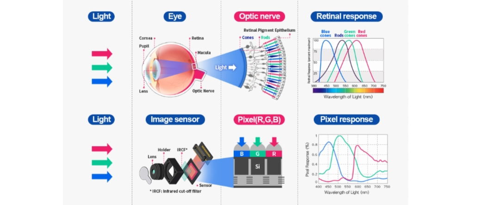
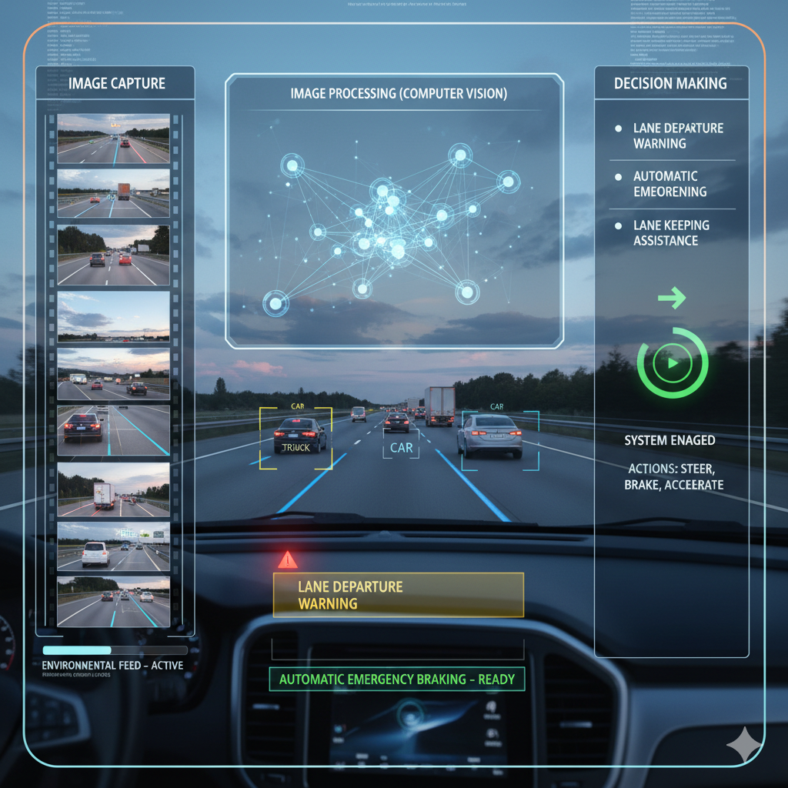

# Camera Sensor in ADAS

## 1️⃣ What is a Camera Sensor?

A **camera sensor** is an electronic vision device that captures real-time images or videos of the surroundings.  
It acts as the **“eyes” of the ADAS system**, helping the vehicle recognize **lanes, vehicles, pedestrians, traffic signs,** and **obstacles** — just like a human driver.

---

## 2️⃣ How It Works

1. **Image Capture** – Continuously captures frames of the environment.  
2. **Image Processing (Computer Vision)** – Processes images using **CNNs (Convolutional Neural Networks)** or similar algorithms to detect and classify objects.  
3. **Decision Making** – Based on processed data, ADAS decides actions such as:
   - Lane Departure Warning  
   - Automatic Emergency Braking  
   - Lane Keeping Assistance  

---

## 3️⃣ Types of Cameras in ADAS

| Type | Position | Function |
|------|-----------|-----------|
| **Front Camera** | Behind windshield (near rear-view mirror) | Detects lanes, vehicles, pedestrians, traffic signs |
| **Rear Camera** | Back side of car | Assists in reversing and parking |
| **Side Cameras** | Side mirrors | Used for blind-spot monitoring and lane-change assist |
| **Surround (360°) Cameras** | Around vehicle | Provides bird’s-eye view for parking and maneuvering |

---

## 4️⃣ Applications

| Feature | Description |
|----------|-------------|
| **Lane Departure Warning (LDW)** | Detects lane markings and warns if car drifts |
| **Lane Keeping Assist (LKA)** | Steers vehicle back into lane automatically |
| **Traffic Sign Recognition (TSR)** | Reads road signs like speed limits or stop signs |
| **Forward Collision Warning (FCW)** | Detects vehicles or obstacles in front |
| **Automatic Emergency Braking (AEB)** | Applies brakes if collision is imminent |
| **Pedestrian Detection** | Identifies humans or animals ahead |
| **Driver Monitoring** | Tracks driver’s eyes/face for drowsiness or distraction |
| **Parking Assistance / 360° View** | Multi-camera view helps in parking maneuvers |

---

## 5️⃣ Technologies Used

- **Image Sensors:** CMOS (Complementary Metal–Oxide–Semiconductor)  
- **Lenses:** Wide-angle for maximum field of view  
- **Processing Unit:** Deep Learning or Computer Vision (e.g., CNN, YOLO)  
- **Sensor Fusion:** Works with Radar and LiDAR for higher accuracy  

---

## 6️⃣ Challenges

| Issue | Description |
|--------|--------------|
| **Poor Lighting** | Low light or glare can reduce visibility |
| **Weather Conditions** | Fog, rain, or snow can blur camera image |
| **Lens Contamination** | Dust, mud, or water drops affect image clarity |
| **Processing Delay** | Real-time analysis requires powerful processors |

---

## 7️⃣ Real-World Examples

- 🚗 **Tesla Autopilot** – Uses cameras and AI for perception.  
- 🧠 **Mobileye (Intel)** – Supplies camera-based ADAS to major automakers.  
- 🏎️ **BMW / Mercedes-Benz** – Use stereo cameras for 3D depth perception.

---

