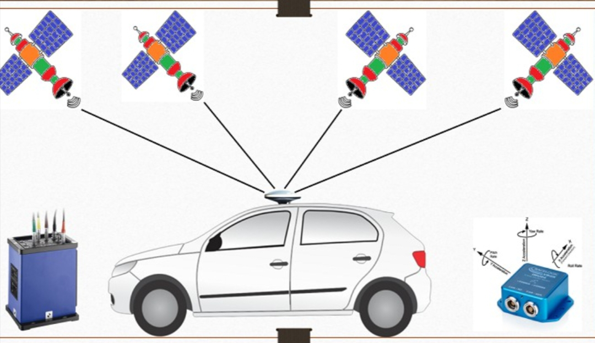

# 🌐 GPS and IMU in ADAS
GPS (Global Positioning System) and IMU (Inertial Measurement Unit) are critical sensors in autonomous driving and ADAS for vehicle localization, navigation, and motion tracking. GPS provides global position coordinates (latitude, longitude, altitude) using satellite signals. IMU measures vehicle acceleration, angular velocity, and orientation using accelerometers and gyroscopes. Together, GPS + IMU provide high-accuracy positioning even when GPS signals are weak or blocked.

## Working Principle
**GPS:** GPS satellites transmit time-stamped signals. The GPS receiver calculates distance from multiple satellites using signal travel time. Using triangulation, the vehicle’s 3D position (x, y, z) is computed. GPS data is typically updated 1–10 Hz.  
**IMU:** Accelerometers measure linear acceleration along X, Y, Z axes. Gyroscopes measure angular velocity (roll, pitch, yaw). Magnetometers (optional) provide heading. IMU data is high-frequency (100–1000 Hz) and used for dead reckoning between GPS updates.

## GPS + IMU Integration
GPS provides absolute position, while IMU provides high-frequency relative motion. Sensor fusion algorithms (e.g., Kalman Filter) combine GPS and IMU for accurate, continuous vehicle localization. Essential in areas with poor GPS coverage (tunnels, urban canyons) for ADAS functions like lane keeping, adaptive cruise control, and autonomous navigation.

## Key Parameters
| Sensor | Parameter | Description |
|--------|-----------|-------------|
| GPS | Accuracy | 1–5 m (standard GPS), cm-level (RTK GPS) |
| GPS | Update Rate | 1–10 Hz |
| GPS | Signals | L1, L2, L5 bands |
| IMU | Accelerometer Range | ±2g to ±16g |
| IMU | Gyroscope Range | ±250°/s to ±2000°/s |
| IMU | Update Rate | 100–1000 Hz |
| IMU | Drift | Accumulates error over time without GPS |

## Applications in ADAS
Vehicle localization for autonomous driving. Dead reckoning in tunnels or urban canyons. Adaptive cruise control (maintaining lane and speed). Lane departure warning and lane keeping assist. High-definition map alignment. Vehicle state estimation (speed, acceleration, heading).

## Advantages
Provides continuous positioning and motion tracking. IMU allows motion detection even without GPS signals. GPS + IMU fusion improves overall navigation accuracy. Low latency for high-speed maneuvers.

## Limitations
GPS accuracy can be affected by signal blockage, multipath, or atmospheric errors. IMU alone drifts over time and accumulates errors. Requires calibration and sensor fusion algorithms for high precision. RTK GPS or DGPS systems increase cost.

## Manufacturers
NovAtel, Trimble, u-blox – GPS receivers. Bosch, Continental, Denso – Automotive IMUs. VectorNav, Analog Devices, InvenSense – High-performance IMUs.

## Use in BMW ADAS
GPS + IMU provides accurate vehicle positioning for navigation and driver-assist features. Supports autonomous driving, lane guidance, and parking assistance. Works with cameras, radar, LiDAR, and ultrasonic sensors in sensor fusion for reliable perception.

