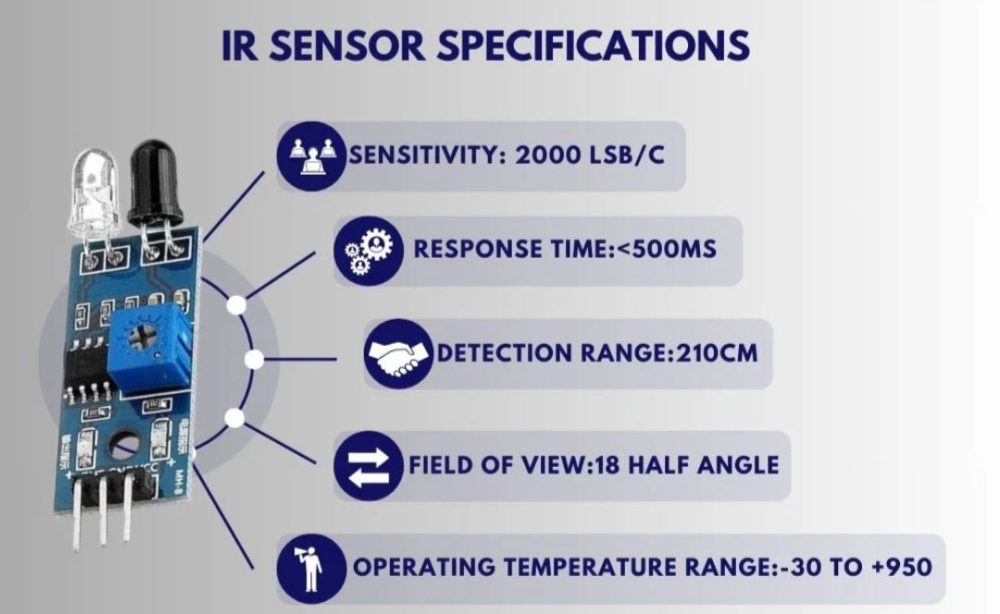

# 🌡️ Infrared Sensors (Thermal Cameras) in ADAS
Infrared sensors, often implemented as thermal cameras, detect heat signatures emitted by objects rather than visible light. They are especially useful for night vision, pedestrian detection, and obstacle detection under poor lighting or adverse weather conditions. IR sensors capture temperature differences in the environment and convert thermal energy into image data (thermogram). They can detect humans, animals, and vehicles in darkness, fog, or smoke.

## Working Principle
Infrared sensors operate as follows: 1. Detection: Thermal radiation emitted by objects is detected by the IR sensor array. 2. Conversion: Sensors convert radiation into electrical signals. 3. Processing: Signals are processed to create a thermal image showing relative temperature differences. 4. Output: Thermal images or videos are used by ADAS for object detection and classification.

## Key Parameters
| Parameter | Description |
|-----------|-------------|
| Wavelength | 8–14 µm (long-wave IR for automotive) |
| Resolution | 160×120 px – 640×480 px |
| Frame Rate | 30–60 fps |
| Temperature Sensitivity | 0.05–0.1°C |
| Field of View (FOV) | 30°–60° typical |
| Detection Range | 30–200 m (depending on lens and sensor) |

## Applications in ADAS
Night Vision Assist: Detects pedestrians, cyclists, and animals in darkness. Collision Avoidance: Alerts driver to obstacles not visible in visible light cameras. Driver Assistance: Improves ADAS reliability in low-light or adverse weather. Enhanced Perception: Complements radar and LiDAR for sensor fusion.

## Advantages
Functions in complete darkness without external light. Detects heat-emitting objects that may not be visible to cameras or radar. Useful in fog, smoke, and low-visibility conditions. Non-contact, passive sensing with low electromagnetic interference.

## Limitations
Lower spatial resolution than optical cameras. Limited range compared to radar and LiDAR. Expensive compared to conventional cameras. Thermal signatures can be affected by environmental conditions (rain, extreme heat).

## Manufacturers
FLIR Systems (Teledyne) – Automotive thermal cameras. Bosch – Night vision assist modules. Continental – Infrared night vision systems. Denso, Valeo – IR imaging for ADAS. Seek Thermal, Hella – Thermal sensors and cameras.

## Use in BMW ADAS
BMW integrates thermal cameras in some high-end models (e.g., Night Vision package). Detects pedestrians and animals at night and provides visual/auditory warnings. Works alongside radar, LiDAR, and optical cameras for sensor fusion to enhance perception and safety.

## Integration in Sensor Fusion
IR sensors complement visible-light cameras in low-light scenarios. Combined with radar, LiDAR, and GPS/IMU for robust, 24/7 vehicle perception. Thermal data helps ADAS prioritize objects by heat signature, improving response in night-time conditions.

