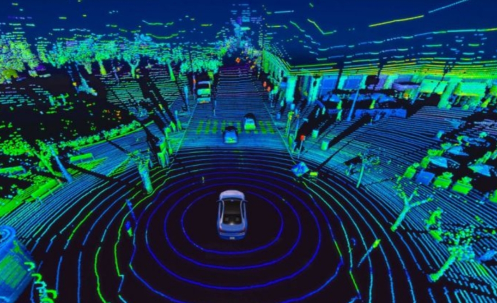

# 🚗 LiDAR Sensors in ADAS (Light Detection and Ranging)
LiDAR (Light Detection and Ranging) sensors are critical components in Advanced Driver Assistance Systems (ADAS) and autonomous vehicles. They use laser pulses to measure distances between the vehicle and surrounding objects, creating accurate 3D maps of the environment. These sensors enable vehicles to perceive their surroundings with high precision, even in complex driving conditions.

## Working Principle
LiDAR operates by emitting laser pulses toward surrounding objects, measuring the time taken for each pulse to reflect back, and calculating the distance using the formula: Distance = (Speed of Light × Time of Flight) / 2. Millions of these measurements are combined to create a 3D point cloud representation of the environment.

## Key Features
- High accuracy and resolution in object detection
- 360° environmental coverage for full scene awareness
- Works effectively in low-light and night-time conditions
- Provides 3D spatial data crucial for path planning and obstacle avoidance

## Applications in ADAS
LiDAR sensors are used in Adaptive Cruise Control (ACC), Collision Avoidance Systems, Lane Keeping Assistance (LKA), Autonomous Parking, and Object Detection and Tracking.

## Advantages
- Precise distance measurement
- Reliable object detection at various speeds
- Works independently of ambient lighting conditions
- Enhances decision-making algorithms in ADAS

## Limitations
- Performance may degrade in heavy rain or fog
- Higher cost compared to other sensors (radar or cameras)
- Generates large data volumes, requiring advanced processing systems

## Integration in ADAS Systems
LiDAR data is often fused with Camera and Radar sensor inputs to achieve a robust perception system. This sensor fusion improves reliability and ensures the vehicle can make safe, accurate driving decisions.

## Types of LiDAR
- Mechanical / Rotating LiDAR: Uses spinning mirrors or lasers to scan 360° horizontally. High accuracy but bulky and expensive. Examples: Velodyne HDL-64E, Ouster OS series.
- Solid-State LiDAR: No moving parts, smaller and durable. Ideal for mass production. Examples: InnovizOne, Luminar Iris, Valeo Scala 2.
- Flash LiDAR: Emits a single wide laser pulse to illuminate the entire scene. Used for short-range 3D sensing.

## Key Parameters
| Parameter | Description |
|-----------|-------------|
| Range | 0.2 m – 250 m |
| Accuracy | ±2 cm |
| Wavelength | 850 nm, 905 nm, or 1550 nm |
| Scan Frequency | 10 Hz – 30 Hz |
| Field of View (FOV) | Horizontal 360°, Vertical 30°–40° |
| Output | 3D Point Cloud Data |

## LiDAR in BMW ADAS
BMW uses Valeo Scala 2 LiDAR in its 7-Series and i7 models for Level 3 autonomous driving. Mounted on the front bumper or roofline, it works with cameras and radar in sensor fusion to enable autonomous lane change, traffic jam pilot, and highway self-driving.

## Sensor Fusion (LiDAR + Camera + Radar)
Combining LiDAR, radar, and camera data provides robust perception. Cameras provide color and texture, radar measures range and velocity, and LiDAR gives a high-resolution 3D map. Sensor fusion ensures reliable autonomous driving decisions.

## Future Trends
- 4D LiDAR: Adds velocity dimension to 3D point cloud
- AI-Enhanced LiDAR: Neural networks segment and classify point clouds
- Hybrid Sensors: Integration of radar and LiDAR into a single module
- Cost Reduction: Solid-state LiDAR is becoming cheaper and smaller for mass-market ADAS

## Tools & Frameworks for LiDAR Data Processing
- Python / C++ for data processing and visualization
- ROS / ROS2 for sensor integration and communication
- Open3D / PCL (Point Cloud Library) for point cloud analysis
- Machine Learning (TensorFlow / PyTorch) for object classification

