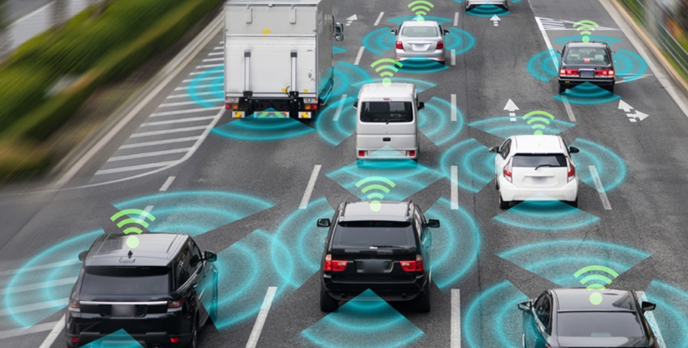

# 🚗 Advanced Driver Assistance Systems (ADAS)

---

## 📘 Overview
**Advanced Driver Assistance Systems (ADAS)** are intelligent electronic systems that assist drivers in driving and parking functions.  
They enhance vehicle safety by detecting nearby obstacles or driver errors, and provide alerts or automatic control of the vehicle.

---

## 🎯 Objectives of ADAS
- Improve **vehicle safety** and **driving comfort**  
- Reduce **human error** in driving  
- Enable **semi-autonomous** and **autonomous** vehicle functions  
- Support **collision avoidance**, **lane keeping**, and **adaptive cruise control**

---

## ⚙️ Key Components
1. **Sensors** – Collect real-time environmental data  
2. **Electronic Control Unit (ECU)** – Processes sensor data and makes decisions  
3. **Actuators** – Execute commands (steering, braking, acceleration)  
4. **Human-Machine Interface (HMI)** – Communicates warnings and feedback to the driver  

---

## 🧠 Types of Sensors Used in ADAS

| Sensor Type | Function | Example Features |
|--------------|-----------|------------------|
| **Camera Sensors** | Capture visual data for object, lane, and sign detection | Lane Departure Warning, Traffic Sign Recognition |
| **Radar Sensors** | Measure distance and speed of surrounding objects | Adaptive Cruise Control, Collision Avoidance |
| **LiDAR Sensors** | 3D mapping and object detection | Autonomous Navigation, Obstacle Detection |
| **Ultrasonic Sensors** | Short-range object detection | Parking Assist, Blind Spot Monitoring |
| **Infrared (Thermal) Cameras** | Detect heat signatures at night or foggy conditions | Pedestrian Detection, Night Vision |
| **GPS & IMU** | Provide position and motion data | Path Planning, Vehicle Localization |

---

## 🔍 Major ADAS Features
1. **Adaptive Cruise Control (ACC)** – Maintains a safe distance from the vehicle ahead  
2. **Lane Keeping Assist (LKA)** – Helps the driver stay within the lane  
3. **Automatic Emergency Braking (AEB)** – Automatically applies brakes to prevent collision  
4. **Blind Spot Detection (BSD)** – Alerts when another vehicle is in the blind spot  
5. **Traffic Sign Recognition (TSR)** – Detects and interprets road signs  
6. **Driver Monitoring System (DMS)** – Detects driver fatigue or distraction  
7. **Parking Assist** – Uses ultrasonic and camera sensors for automated parking  
8. **Surround View System (SVS)** – Provides 360° vehicle view using multiple cameras  

---

## 🧩 Software & Algorithms
- **Machine Learning / Deep Learning** (e.g., CNNs for object detection)  
- **Sensor Fusion** – Combining data from radar, camera, and LiDAR  
- **Computer Vision** – Lane and object recognition  
- **Path Planning & Control** – Autonomous navigation decisions  

---

## 🔧 Technologies Used
- **Programming:** Python, C++, MATLAB  
- **Frameworks:** OpenCV, TensorFlow, PyTorch, ROS (Robot Operating System)  
- **Hardware:** NVIDIA Jetson, Raspberry Pi, Automotive ECUs  
- **Communication:** CAN Bus, Ethernet, LIN  

---

## 🧠 ADAS in Autonomous Driving Levels

| Level | Automation Type | Description |
|--------|-----------------|--------------|
| **Level 0** | No Automation | Driver has full control |
| **Level 1** | Driver Assistance | ACC or LKA individually |
| **Level 2** | Partial Automation | ACC + LKA combined |
| **Level 3** | Conditional Automation | System handles most tasks but needs driver readiness |
| **Level 4** | High Automation | Vehicle can drive autonomously in specific conditions |
| **Level 5** | Full Automation | No driver involvement required |

---

## 🚙 Real-World Implementations
- **Tesla Autopilot**  
- **BMW Driving Assistant**  
- **Mercedes-Benz Drive Pilot**  
- **Volvo Pilot Assist**  
- **Toyota Safety Sense**

---

## 🌐 Future of ADAS
- Integration with **AI-driven perception models**  
- **V2X Communication (Vehicle-to-Everything)**  
- Enhanced **autonomous decision-making**  
- **Edge AI** for real-time sensor data processing  

---

