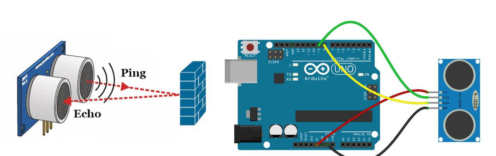

# 🟢 Ultrasonic Sensors in ADAS
Ultrasonic sensors are short-range proximity sensors used in vehicles to detect nearby objects using high-frequency sound waves. They are primarily used for parking assistance, collision avoidance, and low-speed maneuvering. Ultrasonic sensors operate in the range of 0.2 m to 5 m and are commonly integrated in bumpers and corners of vehicles.
## Working Principle
Ultrasonic sensors operate as follows: 1. Transmission: The sensor emits an ultrasonic wave (typically 40 kHz). 2. Reflection: The wave bounces off nearby objects and returns to the sensor. 3. Time Measurement: The sensor calculates distance using the time of flight (ToF) of the sound wave: `Distance = (Speed of Sound × Time of Flight) / 2`. 4. Output: Provides distance measurements used to warn the driver or trigger automated actions.

## Key Parameters
| Parameter | Description |
|-----------|-------------|
| Range | 0.2 m – 5 m |
| Accuracy | ±1–3 cm |
| Frequency | ~40 kHz |
| Field of View (FOV) | 30°–60° |
| Response Time | ~50–100 ms |
| Placement | Front, rear, and side bumpers |
## Applications in ADAS
Parking Assist: Detects obstacles while parking, providing visual or audio feedback. Collision Avoidance: Alerts the driver of objects at very close range. Automated Parking Systems: Enables self-parking using real-time proximity data. Blind Spot Detection (short-range). Cross-Traffic Alert (low-speed scenarios).
## Advantages
Works reliably at very close distances. Low-cost and easy to integrate into vehicles. Lightweight, small, and low power consumption. Functions well in most lighting conditions.
## Limitations
Short detection range (limited to ~5 m). Accuracy affected by soft or angled surfaces. Cannot detect fast-moving objects at longer distances. Performance can be impacted by dirt, snow, or mud covering the sensors.
## Manufacturers
Bosch – Ultrasonic parking sensors. Continental – Short-range ultrasonic modules. Denso – Parking and proximity sensors. Valeo / Hella / Delphi – Automotive ultrasonic systems. Infineon, NXP – Ultrasonic sensor ICs.
## Use in BMW Vehicles
Multiple ultrasonic sensors around front and rear bumpers. Used in Parking Assistant, 360° camera systems, and low-speed collision warnings. Works together with cameras, radar, and other sensors to provide enhanced sensor fusion for safety.
## Integration in Sensor Fusion
Ultrasonic sensors complement radar and cameras at short range. They provide close-proximity data for maneuvering, while radar and camera handle mid-to-long range detection. They are essential for automated parking and obstacle detection in confined spaces.

